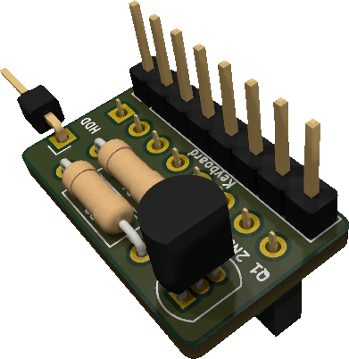

# a500hddled - A500 keyboard HDD LED mod

This repo contains Kicad sources for a board to light up the Disk LED on keyboard on HDD activity.

It is useful to users having an internal HDD controller.

## Design

The circuit implements the same schematic as the original A500 FDD LED circuit.

## Board production

I use JLCPCB with the following options:
* PCB Thickness: 1.2
